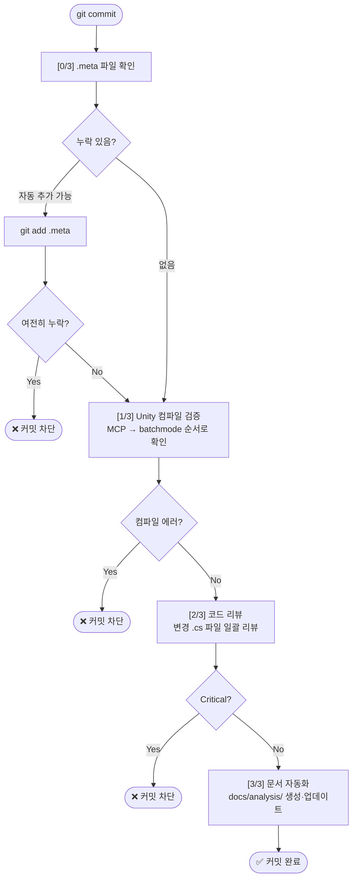

# claude-unity-harness

Unity 프로젝트를 위한 Claude Code 플러그인.

세션 관리 하네스, 코드 리뷰, 설계 플랜, 문서화, pre-commit 자동 리뷰를 제공합니다.

---

## 설치

```
/plugin marketplace add https://github.com/cwp10/claude-unity-harness
/plugin install claude-unity-harness@cwp10-plugins
```

설치 후 Unity 프로젝트 루트에서 최초 1회 실행:

```
/setup
```

---

## 슬래시 커맨드

| 커맨드 | 설명 |
|--------|------|
| `/setup` | 프로젝트 초기화 — CLAUDE.md 스택 설정, 하네스 파일 생성, hook 설치 |
| `/context-load` | 세션 시작 — 이전 진행 상황 복구 |
| `/context-save` | 세션 종료 — 진행 상황 저장 + git 커밋 |
| `/plan [기능명]` | 설계 플랜 생성 |
| `/review [파일]` | 코드 리뷰 |
| `/audit` | 전체 감사 + 빌드 체크 |
| `/refactor [대상]` | 리팩토링 플랜 + 실행 |
| `/fix [오류]` | 버그 진단 + 수정 |
| `/analyze [대상]` | 코드·시스템 분석 |
| `/git-summary` | 커밋 메시지 제안 |
| `/doc readme\|handover\|delivery` | 문서 생성 |
| `/deep-interview` | 요구사항 심층 인터뷰 |
| `/setup-check` | 설치 상태 점검 |
| `/unity-setup-mcp` | Unity MCP 서버(CoplayDev/unity-mcp) 연동 설정 |
| `/unity-console` | Unity 콘솔 에러·경고 분석 + 수정 제안 (UnityMCP 필요) |
| `/unity-test [EditMode\|PlayMode]` | 테스트 실행 + 실패 원인 분석 (UnityMCP 필요) |
| `/unity-scene-audit` | 현재 씬 품질 감사 — Missing·네이밍·성능 점검 (UnityMCP 필요) |

### 자동 로드 스킬

| 스킬 | 로드 조건 |
|------|----------|
| `unity-patterns` | Unity C# 코드 작성·설계·리팩토링 시 자동 로드 |

---

## 포함 컴포넌트

```
claude-unity-harness/
│
├── skills/                  슬래시 커맨드 구현체 (17개 + 자동 로드 스킬 1개)
│   ├── plan/                설계 플랜 생성
│   ├── review/              코드 리뷰
│   ├── refactor/            리팩토링 플랜 + 실행
│   ├── audit/               전체 감사
│   ├── fix/                 버그 진단
│   ├── analyze/             코드 분석
│   ├── doc/                 문서 생성 (readme · handover · delivery)
│   ├── git-summary/         커밋 메시지 제안
│   ├── deep-interview/      요구사항 인터뷰
│   ├── context-load/        세션 시작 루틴
│   ├── context-save/        세션 종료 루틴
│   ├── setup/               프로젝트 초기화
│   ├── setup-check/         설치 상태 점검
│   ├── unity-setup-mcp/     Unity MCP 서버 연동 설정
│   ├── unity-console/       Unity 콘솔 에러·경고 분석 (UnityMCP)
│   ├── unity-test/          테스트 실행 + 실패 분석 (UnityMCP)
│   ├── unity-scene-audit/   씬 품질 감사 (UnityMCP)
│   └── unity-patterns/      Unity C# 패턴 레퍼런스 (자동 로드)
│
├── agents/                  스킬이 내부적으로 위임하는 전문 에이전트
│   ├── codebase-explorer    코드베이스 탐색 · 의존 관계 파악
│   ├── architect-planner    설계 플랜 · 리팩토링 플랜 작성
│   ├── unity-reviewer       Unity C# 코드 리뷰
│   ├── doc-writer           문서 작성
│   ├── debugger             버그 진단
│   ├── critic               대안 제시 · 성능 최적화 관점
│   └── verifier             최종 스펙 검증 · passes:true 판정
│
├── hooks/
│   └── pre-commit           git commit 시 자동 실행 (아래 상세 설명)
│
├── rules/
│   ├── response.md          소통 언어 · 응답 원칙 · 금지 사항
│   ├── git.md               브랜치 전략 · 커밋 메시지 컨벤션
│   └── code-review.md       심각도 기준 (Critical / Warning / Suggestion)
│
├── engines/
│   └── unity.md             Unity 6 LTS 코딩 규칙 · 네이밍 · 생명주기
│
├── languages/
│   └── csharp.md            C# 스타일 가이드 · 포맷 규칙
│
└── domains/
    └── unity.md             Unity 아키텍처 패턴 · UI · 물리 · 씬 관리
```

---

## 운영 방식 상세

### 1. 세션 관리 — 자동 + `/context-load` / `/context-save`

**세션 시작·종료는 hooks.json에 의해 자동으로 처리됩니다.** `/context-load`와 `/context-save`는 그 위에서 동작하는 보조 커맨드입니다.

#### 자동 동작 (hooks.json)

| 이벤트 | 동작 |
|--------|------|
| **SessionStart** | `project-memory.json` · `claude-progress.txt` · `feature_list.json` **세 파일 모두** 동시에 컨텍스트 주입 + `.context_loaded` 생성 |
| **UserPromptSubmit** | 첫 번째 메시지 전에 컨텍스트가 없으면 동일하게 자동 주입 (SessionStart 누락 보정) |
| **Stop** | 매 응답 완료 후 `project-memory.json`의 `savedAt` 타임스탬프 갱신 (bash만 실행 — 비용 $0) |
| **PreCompact** | 컨텍스트 압축 직전 LLM(haiku)이 대화 내용을 분석해 `project-memory.json` + `claude-progress.txt` 동시 갱신 |
| **SessionEnd** | `claude-progress.txt`에 날짜 플레이스홀더 행 즉시 기록 (100% 신뢰) → `.context_loaded` 플래그 삭제 |
| **PreToolUse (Write/Edit)** | `.cs` 파일 수정 직전마다 Unity C# 핵심 규칙(m\_ 접두사, Allman 중괄호 등) 자동 주입 |
| **PostToolUse (Write/Edit)** | `.cs` 파일 저장 직후 `.meta` 누락 경고 자동 출력 |

#### `/context-load` — 수동 복구 요약

자동 주입된 컨텍스트를 **사람이 읽기 좋은 형태로 정리**하고 다음 작업을 제안합니다.

1. `project-memory.json` + `.claude/claude-progress.txt` 내용 정리 출력
2. `.claude/feature_list.json`에서 `passes: false` 항목 확인 — 다음 할 작업 파악
3. `git log --oneline -10`으로 최근 커밋 이력 확인
4. "1번 작업부터 시작할까요?" 질문

```
/context-load
→ 마지막 작업: PlayerController 리팩토링 완료
→ 현재 진행: 인벤토리 시스템 구현 중 (2/5 기능 완료)
→ 다음 작업: 아이템 드롭 시스템
→ 알려진 이슈: 씬 전환 시 아이템 데이터 초기화 문제
```

#### `/context-save` — 수동 저장 + 커밋

작업을 마칠 때 실행합니다. 파일 저장과 git 커밋까지 처리합니다.

1. 현재 대화에서 완료된 작업·미완료 작업·설계 결정·발견된 문제를 추출합니다.
2. `.claude/claude-progress.txt` 업데이트 — 세션 이력 테이블에 오늘 항목 추가, 다음 작업 갱신.
3. `.claude/project-memory.json` 업데이트 — 기술 스택·현재 기능·결정 이력(append) 갱신.
4. `.claude/feature_list.json`에서 `passes: true`로 변경된 항목 확인 + 전체 진행률 반영.
5. 변경사항이 있으면 자동 `git commit` — 세션 내용에 따라 커밋 타입 자동 선택:

| 세션 내용 | 커밋 타입 |
|----------|----------|
| 새 기능 구현 완료 | `[feat]` |
| 버그 수정 | `[fix]` |
| 리팩토링 | `[refactor]` |
| 문서·분석 파일만 | `[docs]` |
| 설정·하네스 파일 | `[chore]` |

```
/context-save
→ .claude/claude-progress.txt 업데이트
→ project-memory.json 업데이트
→ git commit: "[feat] 인벤토리 시스템 기본 구조 구현"
→ "다음 세션에서 컨텍스트가 자동 로드됩니다"
```

---

### 2. 설계 — `/plan`

새 기능을 만들기 전에 `/plan 기능명`으로 설계 플랜을 먼저 생성합니다.

**내부 동작:**
1. `codebase-explorer` 에이전트가 기존 코드베이스를 탐색해 유사 패턴·의존 관계를 파악합니다.
2. `architect-planner` 에이전트가 탐색 결과를 바탕으로 설계 플랜을 작성합니다.
   - 규모 판단 (Small / Medium / Large)
   - 클래스·컴포넌트 다이어그램
   - 구현 로드맵
   - 대안 2가지 + 트레이드오프
3. 플랜 승인 대기 — **승인 전에는 코드를 작성하지 않습니다.**
4. 승인 시: `docs/architecture/기능명-설계.md` 저장 + `.claude/feature_list.json`에 `passes: false`로 항목 추가.
5. 단계별 코드 구현 시작.

```mermaid
flowchart LR
    A[/plan 인벤토리 시스템] --> B[codebase-explorer\n기존 코드 탐색]
    B --> C[architect-planner\n설계 플랜 + 대안 2가지]
    C --> D{승인?}
    D -- 거절 --> C
    D -- 승인 --> E[docs/architecture/ 저장\nfeature_list.json 항목 추가]
    E --> F[단계별 코드 구현]
```

---

### 3. 코드 리뷰 — `/review`

`/review 파일경로` 또는 변경 파일 자동 감지.

**내부 동작:**
1. `codebase-explorer` 에이전트가 대상 파일의 인터페이스·부모 클래스·역참조를 탐색합니다.
2. `unity-reviewer` 에이전트가 독립 평가자 관점으로 리뷰합니다.
   - 성능: `Update()` 안의 `GetComponent`·`new`·LINQ
   - Unity 규칙: public 필드 노출, Resources.Load, 구형 Input, 이벤트 해제 누락
   - 아키텍처: SRP 위반, 싱글턴 남용, 강한 결합
   - 안전성: null 참조, 씬 전환 참조 유실, CancellationToken 미전달
3. 심각도 분류 및 수정 코드 제시:
   - 🔴 Critical → 즉시 수정 필요
   - 🟡 Warning → 이번 작업 중 수정
   - 🟢 Suggestion → 다음 기회에 반영
4. Critical 0건이면 `verifier` 에이전트로 최종 스펙 검증 후 `passes: true` 처리를 권장합니다.
5. "더 나은 구현 방법이 궁금하면 `critic` 돌려줘"라고 안내 — `critic` 에이전트는 성능 최적화·대안 패턴을 추가로 제시합니다.

---

### 4. 리팩토링 — `/refactor`

`/refactor 대상파일_또는_폴더` — 새 기능 개발이 아닌 기존 코드 개선에만 사용합니다.

**내부 동작 — 규모에 따라 처리 방식이 다릅니다:**

| 규모 | 기준 | 처리 |
|------|------|------|
| Small | 메서드 추출·네이밍·중복 제거 (1~2개 파일) | 즉시 수정 |
| Medium | 클래스 분리·패턴 교체 (3~5개 파일) | 플랜 제시 → 승인 → 단계별 수정 |
| Large | 아키텍처 변경·크로스 시스템 (6개+ 파일) | `architect-planner` 에이전트 위임 |

1. `codebase-explorer`가 역참조(이 코드를 참조하는 파일)와 기존 리팩토링 이력(`docs/refactor/`)을 파악합니다.
2. 규모를 판단해 처리 방식 결정.
3. 완료 후 `docs/refactor/이력.md`에 날짜·변경 내용·개선 효과를 저장합니다.
4. `verifier` 에이전트로 컴파일 오류 없음을 검증합니다.

---

### 5. 문서 생성 — 자동 + `/doc`

**자동 생성 (git commit 시):**
- `git commit`을 실행할 때마다 pre-commit hook이 변경된 `.cs` 파일을 분석합니다.
- Critical 이슈가 없으면 `docs/analysis/` 아래에 기능 단위 분석 문서를 자동 생성·업데이트합니다.
- 문서는 코드와 함께 같은 커밋에 포함됩니다.

**수동 생성 (`/doc`):**

| 서브커맨드 | 생성 위치 | 내용 |
|-----------|----------|------|
| `/doc readme` | `README.md` | 프로젝트 개요·구조·빌드 방법 |
| `/doc handover [시스템명]` | `docs/guide/HANDOVER_*.md` | 외주 개발자용 인수인계 문서 |
| `/doc delivery [버전] [날짜]` | `docs/guide/DELIVERY_*.md` | 클라이언트 납품 문서 |

---

### 6. Git 커밋 — pre-commit hook

`git commit` 실행 시 **자동으로 3단계**가 실행됩니다.



커밋 메시지는 `/git-summary`로 논리적 단위와 메시지를 제안받을 수 있습니다.

긴급 시 리뷰 생략:
```bash
git commit --no-verify -m "[hotfix] 긴급 수정"
```

---

## 실제 작업 워크플로우

### 새 프로젝트 시작

```mermaid
flowchart LR
    A([프로젝트 루트]) --> B[/setup\nCLAUDE.md + hook 설치\nfeature_list.json 생성]
    B --> C[/deep-interview\n요구사항 구조화\nfeature_list.json 항목 채우기]
    C --> D([개발 시작])
```

### 매 작업 세션 흐름

```mermaid
flowchart TD
    START([Claude Code 실행]) --> SI[SessionStart hook\n세 파일 컨텍스트 자동 주입]
    SI --> CL{복구 요약\n필요?}
    CL -- Yes --> CLL[/context-load\n상태 정리 + 다음 작업 제안]
    CL -- No --> DEV
    CLL --> DEV

    DEV[feature_list에서\npasses:false 항목 선택] --> PLAN[/plan 기능명]
    PLAN --> CODE[코드 구현\nPreToolUse: C# 규칙 자동 주입]
    CODE --> REVIEW[/review\nCritical 0건 확인]
    REVIEW --> VERIFY[verifier\npasses:true 판정]
    VERIFY --> MORE{다음 기능?}
    MORE -- Yes --> DEV
    MORE -- No --> END

    CODE -.->|매 응답| STOP[Stop hook\nsavedAt 갱신 - 비용 0]
    CODE -.->|컨텍스트 압축 시| COMPACT[PreCompact hook\nproject-memory + progress 갱신]

    END([대화 종료]) --> SE[SessionEnd hook\nclaude-progress.txt\n플레이스홀더 자동 기록]
    SE --> CS{즉시 저장\n+ 커밋 필요?}
    CS -- Yes --> CSave[/context-save\n상세 저장 + git commit]
    CS -- No --> DONE([완료])
    CSave --> DONE
```

### 외주·납품 시

```mermaid
flowchart LR
    A[/doc handover 시스템명] --> B[docs/guide/HANDOVER_*.md\n역할·API·주의사항·의존성 맵]
    C[/doc delivery v1.0.0 날짜] --> D[docs/guide/DELIVERY_*.md\n구현 기능·실행 방법·제한사항]
```

---

## 요구 사항

- Claude Code CLI
- Unity 6 LTS
- Git (Windows: Git Bash / macOS: 기본 터미널)
